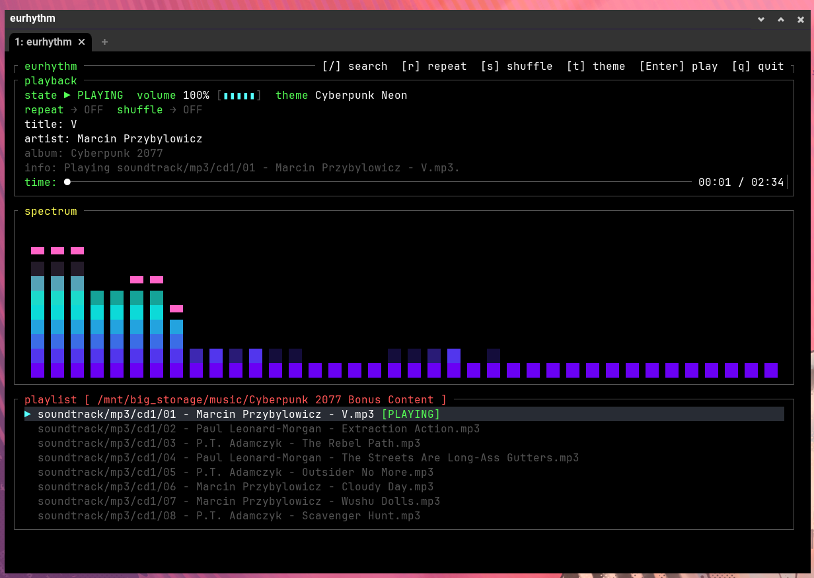
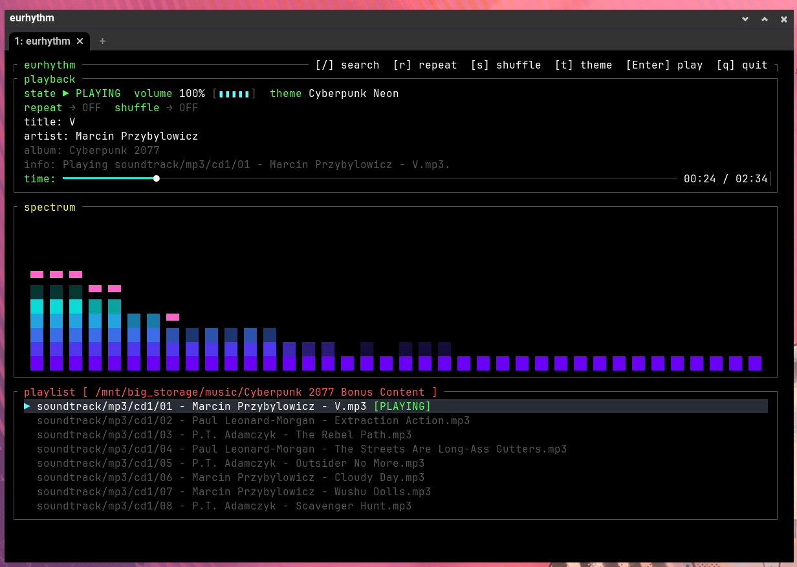

# 🎼 eurhythm

A premium, high-performance TUI (Terminal User Interface) music player and real-time audio spectrum visualizer written in Rust.

`eurhythm` combines low-latency playback engine design with highly optimized, hardware-accelerated Fast Fourier Transform (FFT) spectrum calculations and 24-bit True Color gradients. It's designed [...]

<p align="center">
  
  
</p>

---

## ✨ Features

* **🌌 Curated 24-bit True Color Gradient Themes:**
  * **Cyberpunk Neon**: Radiant violet to electric teal and hot pink peak caps.
  * **Golden Sunset**: Warm golden yellow to deep orange and sleek white peak caps.
  * **Northern Aurora**: Deep forest/slate green to electric mint and mint-white peak caps.
  * **Classic Vintage**: Retro-inspired neon teal to golden orange and vibrant crimson.
  * *Theme can be cycled in real time by pressing `t` during active playback.*
* **🏎️ High-Fidelity Audio Timeline & Micro-Meters:**
  * **Dynamic Status Glyph**: Displays current state as `▶ PLAYING`, `⏸ PAUSED`, or `■ IDLE` using high-contrast color indicators.
  * **Neon Timeline Tracker**: Built a precision progress bar using a cyan progress track (`━`), a distinct white playhead (`●`), and a dark-grey empty track (`─`).
  * **Volume Overdrive Meter**: Replaced raw number outputs with a dynamically expanding visual micro-meter (supporting up to 200% volume). 
    * Under 100% volume, it maintains a sleek, constant **5-slot** length rendered in Cyan: `[▮▮▮░░]`.
    * Exceeding 100% volume triggers a physical **Electric Red** extension (up to 10 slots): `[▮▮▮▮▮▮▮▮▮▮]` to mimic a mechanical red-line warning zone.
* **📂 Advanced Playback Management:**
  * Support for **Shuffle (LCG)** and **Repeat Mode** (Off, All, One) toggling.
  * High-performance ID3 metadata extraction using the `lofty` parser.
  * Full-row active selection styling with a slate-grey visual backdrop and glowing carets.

---

## 🛠️ Key Controls

| Key | Action |
| :--- | :--- |
| `Space` / `Enter` | Play / Pause selected track |
| `s` / `S` | Toggle Shuffle |
| `r` / `R` | Cycle Repeat Mode (Off ➔ All ➔ One) |
| `t` / `T` | Cycle visualizer gradient themes |
| `/` | Enter interactive playlist filter search |
| `Up` / `Down` | Move selection caret in playlist |
| `Left` / `Right` | Seek backward / forward 5 seconds |
| `+` / `-` | Increase / decrease playback volume |
| `q` / `Q` / `Esc` | Safely terminate the application |

---

## 🚀 Getting Started

### Prerequisites

Ensure you have Rust and Cargo installed. (Minimum Edition: `2024`)

### Installation & Run

1. Clone this repository:
   ```bash
   git clone https://github.com/eresende/eurhythm.git
   cd eurhythm
   ```
2. Build and run, specifying the path to your music directory:
   ```bash
   cargo run -- /path/to/your/music
   ```

---

## ⚙️ Architecture & Dependencies

Built from the ground up using pure-Rust high-fidelity abstractions:
* **[`rodio`](https://github.com/RustAudio/rodio)**: Audio playback engine.
* **[`rustfft`](https://github.com/ejmahler/RustFFT)**: High-performance FFT library for real-time spectrum analysis.
* **[`crossterm`](https://github.com/crossterm-rs/crossterm)**: Pure Rust terminal manipulation for fast, raw-mode TUI rendering.
* **[`lofty`](https://github.com/HexagonTek/lofty)**: Robust audio metadata (ID3 tags) parsing.

---

## 📜 License

This project is licensed under the MIT License - see the [LICENSE](LICENSE) file for details.

---

*Rediscovering the joy of building using Rust.* Developed by **[Eusebio Resende](https://eusebioresende.com/)**.
